# XMem++

## Production-level Video Segmentation From Few Annotated Frames

[Maksym Bekuzarov](https://www.linkedin.com/in/maksym-bekuzarov-947490165/)$^\dagger$, [Ariana Michelle Bermudez Venegas](https://www.linkedin.com/in/ariana-bermudez/)$^\dagger$, [Joon-Young Lee](https://joonyoung-cv.github.io/), [Hao Li](https://www.hao-li.com/Hao_Li/Hao_Li_-_about_me.html)

Metaverse Lab @ [MBZUAI](https://mbzuai.ac.ae/) (Mohamed bin Zayed University of Artificial Intelligence)

[[arXiv]](https://arxiv.org/abs/2307.15958) [[PDF]](https://arxiv.org/pdf/2307.15958.pdf) [[Project Page]](https://xmem2.surge.sh)

$^\dagger$ These authors equally contributed to the work.

## Table of contents
* [Performance demo)](#demo)
* [Overview](#overview)
* [Getting started](#getting-started)
* [Use the GUI](#use-the-gui)
* [Use **XMem++** command-line and Python interface](#use-xmem-command-line-and-python-interface)
* [Importing existing projects](#importing-existing-projects)
* [Docker support](#docker-support)
* [Data format](#data-format)
* [Training](#training)
* [Methodology](#methodology)
* [Frame annotation candidate selector](#frame-annotation-candidate-selector)
* [PUMaVOS Dataset](#pumavos-dataset)
* [Citation](#citation)
## Demo

Inspired by movie industry use cases, **XMem++** is an Interactive Video Segmentation Tool that takes a few user-provided segmentation masks and segments very challenging use cases with minimal human supervision, such as 

- **parts** of the objects (only 6 annotated frames provided):

https://github.com/max810/XMem2/assets/29955120/3d3761e2-2e73-484a-a1ed-ec717d8fed05


- **fluid** objects like hair (only 5 annotated frames provided):

https://github.com/max810/XMem2/assets/29955120/ba746a2a-6333-4654-b39c-b93b9eb1ae0c

- **deformable** objects like clothes (5 and 11 annotated frames used accordingly)

https://github.com/max810/XMem2/assets/29955120/3a8750e0-44ca-4cce-9b16-8f7154dbb217

https://github.com/max810/XMem2/assets/29955120/689512a6-f60a-4258-b282-4b799f12b0c9

### [[LIMITATIONS]](docs/LIMITATIONS.md)

## Overview

| 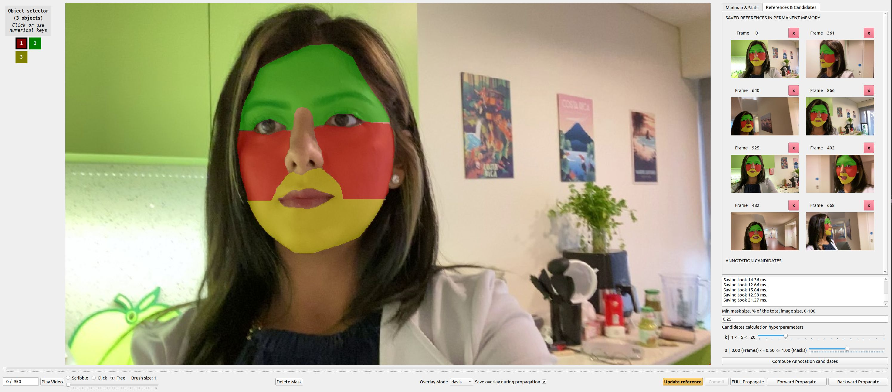 | 
|:--:| 
| _XMem++ updated GUI_ |

**XMem++** is built on top of [XMem](https://github.com/hkchengrex/XMem) by [Ho Kei Cheng](https://hkchengrex.github.io/), [Alexander Schwing](https://www.alexander-schwing.de/) and improves upon it by adding the following:
1. [Permanent memory module](#methodology) that greatly improves the model's accuracy with just a few manual annotations provided (see results)
2. [Annotation candidate selection algorithm](#frame-annotation-candidate-selector) that selects $k$ next best frames for the user to provide annotations for.
3. We used **XMem++** to collect and annotate **PUMaVOS** - 23 video dataset with unusual and challenging annotation scenarios at 480p, 30FPS. See [Dataset](#pumavos-dataset)

In addition to the following features:
* Improved GUI - references tab to see/edit what frames are in the permanent memory, candidates tab - shows candidate frames for annotation predicted by the algorithm and more.
* Negligible speed and memory usage overhead compared to XMem (if using few manually provided annotations)
* [Easy to use Python interface](docs/PYTHON_API.md) - now you can use **XMem++** as a GUI application and a Python library easily.
* 30+ FPS on 480p footage on RTX 3090
* Come with a GUI (modified from [MiVOS](https://github.com/hkchengrex/MiVOS/tree/MiVOS-STCN)).

## Getting started
### Environment setup
First, install the required Python packages:

* Python 3.8+
* PyTorch 1.11+ (See [PyTorch](https://pytorch.org/) for installation instructions)
* `torchvision` corresponding to the PyTorch version
* OpenCV (try `pip install opencv-python`)
* Others: `pip install -r requirements.txt`
* To use the GUI: `pip install -r requirements_demo.txt`

### Download weights

Download the pretrained models either using `./scripts/download_models.sh`, or manually and put them in `./saves` (create the folder if it doesn't exist). You can download them from [[XMem GitHub]](https://github.com/hkchengrex/XMem/releases/tag/v1.0) or [[XMem Google Drive]](https://drive.google.com/drive/folders/1QYsog7zNzcxGXTGBzEhMUg8QVJwZB6D1?usp=sharing). For inference you only need `XMem.pth`, but for GUI also download `fbrs.pth` and `s2m.pth`.

## Use the GUI
To run the GUI on a new video:
```Bash
python interactive_demo.py --video example_videos/chair/chair.mp4
```

To run on a list of images:
```Bash
python interactive_demo.py --images example_videos/chair/JPEGImages
```

Both of these commands will create a folder for the current vide in workspace folder (default is `.workspace`) and save all the masks and predictions there.


To keep editing an existing project in a workspace, run the following command:
```Bash
python interactive_demo.py --workspace ./workspace/<video_name>
```

If you have more than 1 object make sure to add `--num-objects <num_objects>` to the commands above the **first time you create a project**. It will saved in the project file after that for your convenience =)

Like this:
```Bash
python interactive_demo.py --images example_videos/caps/JPEGImages --num-objects 2
```

For more information visit [DEMO.md](docs/DEMO.md)

## Use **XMem++** command-line and Python interface
We provide a simple command-line interface in [process_video.py](process_video.py) which you can use like this:

```Bash
python process_video.py \
    --video <path to video file/extracted .jpg frames> \
    --masks <path to directory with existing .png masks> \
    --output <path to save results>
```
The script will just take existing video and ground truth masks (all in the given directory will be used) and runs segmentation once.

Short-form arguments `-v -m -o` are also supported.

See [Python API](docs/PYTHON_API.md) or [main.py](main.py) for more complex use-cases and explanations.

## Importing existing projects

If you already have existing frames and/or masks from other tools, you can import them into the workspace with the following command:

```Bash
python import_existing.py  --name <name_of_the_project_to_create> [--images <path_to_folder_with_frames>] [--mask <path_to_folder_with_masks>]
```

_One of `--images`, `--masks` (or both) should be specified_.

_You can also specify `--size <int>` to resize the frames on-the-fly (to smaller side, preserving ratio)_

This will do the following:
1. Create a project directory inside your woskpace with the name from the `--name` argument.
2. Copy your given images/masks inside.
3. Convert RGB masks to necessary color palette (XMem++ uses [DAVIS color palette](util/palette.py), where each new object=new color).
4. Resize the frames if specified with the `--size` argument.

## Docker support
We provide 2 images at [DockerHub](https://hub.docker.com/repository/docker/max810/xmem2/general):
- `max810/xmem2:base-inference` - smaller and lighter - for running inference from command line as in [Command line section](#use-xmem-command-line-and-python-interface).
- `max810/xmem2:gui` - for running the graphical interface interactively.

To use them just run `./run_inference_in_docker.sh` or `./run_gui_in_docker.sh` with corresponding cmd/gui arguments (see respective sections [[Inference]](#use-xmem-command-line-and-python-interface) [[GUI]](#use-the-gui)). _They supply proper arguments to `docker run` command and create the corresponding volumes for input/output directories automatically_.

Examples:
```Bash
# Inference
./run_inference_in_docker.sh -v example_videos/caps/JPEGImages -m example_videos/caps/Annotations -o directory/that/does/not/exist/yet

# Interactive GUI
./run_gui_in_docker.sh --video example_videos/chair/chair.mp4 --num_objects 2
```
For the GUI you can change variables `$LOCAL_WORKSPACE_DIR` and `$DISPLAY_TO_USE` in [run_gui_in_docker.sh](run_gui_in_docker.sh#L54) if necessary.

_Be wary that the interactive import buttons will not work (they will open paths within the container filesystem, not the host one)._
### Building your own images
For command-line inference:

```Bash
docker build . -t <your-repo/your-image-name[:your-tag]> --target xmem2-base-inference
```

For GUI:
```Bash
docker build . -t <your-repo/your-image-name[:your-tag]> --target xmem2-gui
```
## Data format
- Images are expected to use .jpg format.
- Masks are RGB .png files that use the [DAVIS color palette](util/palette.py), saved as a palette image (`Image.convert('P')` in [Pillow Image Module](https://pillow.readthedocs.io/en/latest/reference/Image.html#PIL.Image.Image.convert))). If your masks don't follow this color palette, just use run `python import_existing.py` to automatically convert them (see [Importing existing projects](#importing-existing-projects)).
- When using `run_on_video.py` with a video_file, masks should be named `frame_%06d.<ext>` starting at `0`: `frame_000000.jpg, frame_0000001.jpg, ...` **This is preferred filename for any use case**.

More information and convenience commands are provided in [Data format help](docs/DATA_FORMAT_HELP.md)

## Training
For training, refer to the [original XMem repo](https://github.com/hkchengrex/XMem/blob/main/docs/TRAINING.md).

_We use the original weights provided by XMem, the model has not been retrained or fine-tuned in any way._

_Feel free to fine-tune XMem and replace the weights in this project._

## Methodology

| 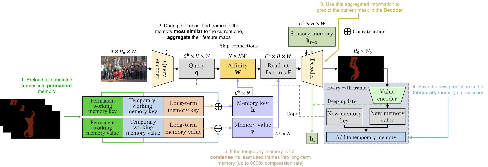 | 
|:--:| 
| *XMem++ architecture overview with comments* |

XMem++ is a **memory-based** interactive segmentation model - this means it uses a set of reference frames/feature maps and their corresponding masks, either predicted or given as ground truth if available, to predict masks for new frames based on **how similar they are to already processed frames** with known segmentation.

Just like XMem, we use the two types of memory inspired by the Atkinson-Shiffrin human memory model - working memory and long-term memory. The first one stores recent convolutional feature maps with rich details, and the other - heavily compressed features for long-term dependencies across frames that are far apart in the video.

However, existing segmentation methods ([XMem](https://arxiv.org/abs/2207.07115), [TBD](https://arxiv.org/abs/2207.06953), [AoT](https://arxiv.org/abs/2106.02638), [DeAOT](https://arxiv.org/abs/2210.09782), [STCN](https://arxiv.org/abs/2106.05210), etc.) that are using memory mechanisms to predict the segmentation mask for the current frame, typically process frames one by one, and thus suffer from a common issue - "jumps" in visual quality, when the new ground truth annotation is encountered in the video

| 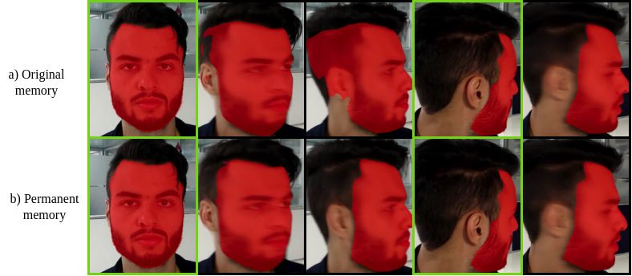 | 
|:--:| 
| *Why permanent memory helps - having multiple annotations from different parts of the video in permanent memory allows the model to __smoothly interpolate__ between different scenes/appearances of the target object* |

To solve this, we propose a new **permanent memory module** - same in implementations as XMem's working memory - we take all the annotations the user provides, process them and put in the permanent memory module. This way **every** ground truth annonation provided by the user can influence **any** frame in the video regardless where it is located. This increases overall segmentation accuracy and allows the model to smoothly interpolate between different appearences of the object (see figure above).

For mode details refer to our arxiv page [[Arxiv]](https://arxiv.org/abs/2307.15958v1) [[PDF]](https://arxiv.org/pdf/2307.15958v1), Section 3.2.
## Frame annotation candidate selector

We propose a simple algorithm to select which frames the user should annotate next to maximize performance and save time. It is based on an idea of **diversity** - to select the frames that capture the most variety of the target object's appearance - to **maximize the information** the network will get with them annotated.

It has the following properties:
- **Target-specific**: Choice of frames depends on which object you are trying to segment. 

<p align="center">
    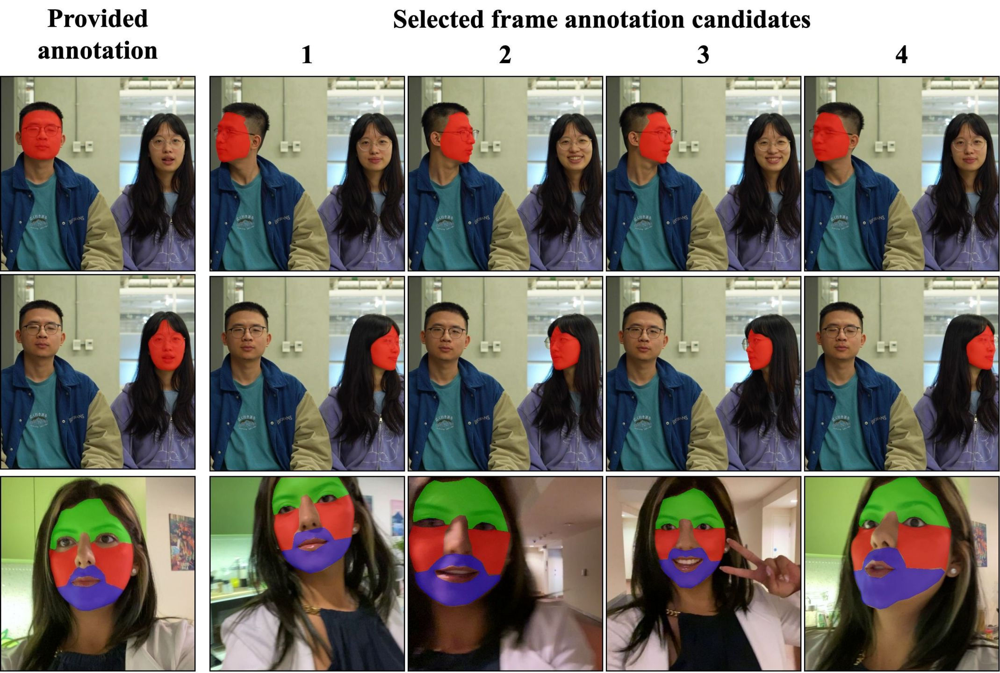
</p>

- **Model-generic**: it operates on convolutional feature maps and pixel-similarity metric (negative $\mathcal{L}_{2}$ distance), so is not specific to **XMem++**.
- **No restrictions on segmentation targets**: Some methods try to automatically estimate the visual quality of the segmentation, which puts an implicit assumption **that good-quality segmentation follows low-level image ques (edges, corners, etc.)**. However, this is not true when segmenting parts of objects, see the :

<p align="center">
    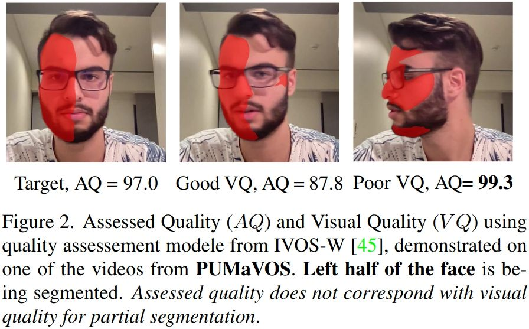
</p>

- **Deterministic and simple**: It orders remaining frames by a **diversity measure** and the user just picks the top $k$ most diverse candidates.


For mode details refer to our arxiv page [[Arxiv]](https://arxiv.org/abs/2307.15958v1) [[PDF]](https://arxiv.org/pdf/2307.15958v1), Section 3.3 and Appendix D.
## PUMaVOS Dataset

We used XMem++ to collect and annotate a dataset of challenging and practical use cases inspired by the movie production industry.

<table width="100%">
<tr>
    <td width="25%">
    <div>
        <p align="center">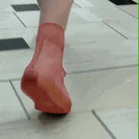</p>
        <p align="center">Shoes <br/> (<i>"billie_shoes" video</i>)</p>
    </div>
    </td>
    <td width="25%">
    <div>
        <p align="center">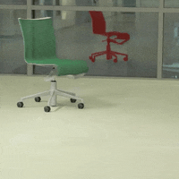</p>
        <p align="center">Reflections <br/> <i>("chair" video)</p>
    </div>
    </td>
    <td width="25%">
    <div>
        <p align="center">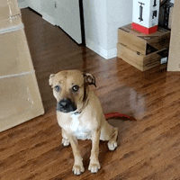</p>
        <p align="center">Body parts <br/> (<i>"dog_tail" video</i>)</p>
    </div>
    </td>
    <td width="25%">
    <div>
        <p align="center">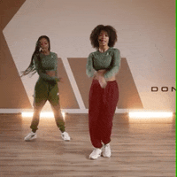</p>
        <p align="center">Deformable objects <br/> (<i>"pants_workout" video</i>)</p>
    </div>
    </td>
</tr>
<tr>
    <td width="25%">
    <div>
        <p align="center">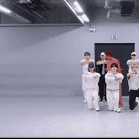</p>
        <p align="center">Similar objects, occlusion <br/> (<i>"skz" video</i>) </p>
    </div>
    </td>
    <td width="25%">
    <div>
        <p align="center">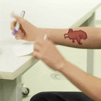</p>
        <p align="center">Tattos/patterns <br/> (<i>"tattoo" video</i>) </p>
    </div>
    </td>
    <td width="25%">
    <div>
        <p align="center">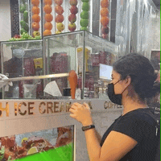</p>
        <p align="center">Quick motion <br/> (<i>"ice_cream" video</i>)</p>
    </div>
    </td>
    <td width="25%">
    <div>
        <p align="center">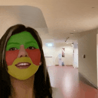 </p>
        <p align="center">Multi-object parts <br/> (<i>"vlog" video</i>) </p>
    </div>
    </td>
</tr>
</table>


**Partial and Unusual Masks for Video Object Segmentation (PUMaVOS)** dataset has the following properties:
- **24** videos, **21187** densely-annotated frames;
- Covers complex practical use cases such as object parts, frequent occlusions, fast motion, deformable objects and more;
- Average length of the video is **883 frames** or **29s**, with the longer ones spanning **1min**;
- Fully densely annotated at 30FPS;
- Benchmark-oriented: no separation into training/test, designed to be as diverse as possible to test your models;
- 100% open and free to download.

### Download
Separate sequences and masks are available here: [[Google Drive]](https://drive.google.com/drive/u/0/folders/1Q7gSCCgemUyweu-7-Yb9G_W55Muq5-bC)
[[Mirror Google Drive]](https://drive.google.com/drive/folders/1_Cpc1fxHuVLFZidw5_0Lfea2EaSVfkC6?usp=drive_link)

PUMaVOS `.zip` download link: [[Google Drive]](https://drive.google.com/file/d/1VAClrxhWWiu9Y39QtcoUhp2YBN7R_ZCD/view?usp=sharing)
[[Mirror Google Drive]](https://drive.google.com/file/d/1qPqg72sqlwCMyvgHFFKBd2HCKFguNJCT/view?usp=drive_link)

### LICENSE

PUMaVOS is released under [CC BY 4.0 license](https://creativecommons.org/licenses/by/4.0/), - you can use it for any purpose (including commercial), you only need to credit the authors (us) whenever you do and indicate if you've made any modifications. See the full license text in [LICENSE_PUMaVOS](LICENSE_PUMaVOS)

## Citation

If you are using this code or PUMaVOS dataset in your work, please cite us:

```
@misc{bekuzarov2023xmem,
      title={XMem++: Production-level Video Segmentation From Few Annotated Frames}, 
      author={Maksym Bekuzarov and Ariana Bermudez and Joon-Young Lee and Hao Li},
      year={2023},
      eprint={2307.15958},
      archivePrefix={arXiv},
      primaryClass={cs.CV}
}
```
Contact: <maksym.bekuzarov@gmail.com>, <bermudezarii@gmail.com>, <jolee@adobe.com>, <hao@hao-li.com>
