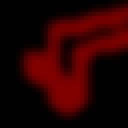

# Data format for processing
## GUI
For the GUI demo the following constraints must be satisfied:
- If using the `--video` argument, a video file can be anything that OpenCV can read.
- If using the `--images` argument, they should be named `frame_000000.jpg`, `frame_000001.jpg`, etc. General format: `frame_%06d.jpg`
- If using the `--workspace` argument, the frames are already saved inside the workspace, so you don't need to do anything.

## Importing existing projects

The name constraints for frames are the same as for the GUI.

When importing masks, they should be called `frame_000000.png`, `frame_000001.png`, etc. General format: `frame_%06d.png`.

## Command line or Python API

The command line and Python API will work fine as long as:
- The frames and masks files have the **same name** (e.g. `001.jpg`, `002.jpg` <-> `001.png`, `002.png`)
- Default alphabetic sorting sorts in the correct increasing order (So `['1.jpg', '10.jpg', '2.jpg']` does not happen). Simplest way to achieve this is by making sure all the numbers in the filenames are **prepended with `0`** to the same length.
- Number don't have to start with 0 as long as they are ordered correctly.

✅ Valid format

```
image_099.jpg, image_100.jpg, image_101.jpg
```

❌ Invalid format

```
image_99.jpg, image_100.jpg, image_101.jpg
```

_When in doubt, just rename everything to `frame_000000.jpg`, `frame_000001.jpg`, i.e. `frame_%06d.jpg`, this will 100% work._

## Convenience tips

If you want to rename your existing frames/masks (preserves original file extension), here's a convenient script in Python:
```Python
import re
import shutil
from pathlib import Path

p_in = Path('/path/to/your/frames')
p_out = Path('/path/where/to/save/renamed/frames')
p_out.mkdir(exist_ok=True, parents=True)

pattern = re.compile(r'\d+')

for p_file in sorted(p for p in p_in.iterdir() if p.is_file()):
    idx = int(re.search(pattern, p_file.stem).group())
    new_name = f'frame_{idx:06d}' + p_file.suffix
    shutil.copyfile(p_file, p_out / new_name)
```

Both cmd/Python API and GUI app can extract frames for you from a video file. However, you can still do it yourself if you need to, using the following `ffmpeg` command:
```Bash
                            # Optional resizing (for images, for masks use `flags=neighbor`)
                                                              # JPEG compression quality (0-51), better->worse, 0 lossless
ffmpeg -i path/to/video.mp4 -vf 'scale=480p:-1:flags=lanczos' -qscale:v 2 existing_output_dir/frame_%06d.jpg  # use .png for masks
```

To concat masks/overlays back to a video use:

```Bash                  
       # FPS                  # or /masks/frame_%06d.png    # MPEG compression quality (0-51), better->worse, 21 is good quality
ffmpeg -r 30 -i workspace/<project>/overlays/frame_%06d.jpg -crf 21 <project>_overlay.mp4
```

## Color scheme (palette)

> Some image formats, such as GIF or PNG, can use a palette, which is a table of (usually) 256 colors to allow for better compression. Basically, instead of representing each pixel with its full color triplet, which takes 24bits (plus eventual 8 more for transparency), they use a 8 bit index that represent the position inside the palette, and thus the color.
-- https://docs.geoserver.org/2.22.x/en/user/tutorials/palettedimage/palettedimage.html

XMem++ app uses colored masks to indicate different objects in the video. Unique color = unique object.

However, storing a mask with 5-10 unique colors as an RGB image is expensive (you have `H x W x 3` elements), so instead we are using a color palette from DAVIS dataset, which maps object indices into colors like this:
```
DAVIS palette
Object index -> RGB color
#####################
0  -> (0,   0,   0  )
1  -> (128, 0,   0  )
2  -> (0,   0,   0  )
3  -> (128, 0,   0  )
4  -> (0, 128,   0  )
5  -> (128, 128, 0  )
6  -> (0,   0,   128)
7  -> (128, 0,   128)
8  -> (0,   128, 128)
9  -> (128, 128, 128)
10 -> (64,  0,   0  )
11 -> (192, 0,   0  )
...
#####################
```
This way to save space and tell the model where each object is in a mask, we store _object indices instead of RGB values_ in it, making it only `H x W` dimensions. 0 is always background and maps to black.

So those mask files that look like color images are single-channel, `uint8` arrays under the hood. When `PIL` reads them, it (correctly) gives you a two-dimensional array (`opencv` does not work AFAIK). If what you get is instead of three-dimensional, `H*W*3` array, then your mask is not actually a paletted mask, but just a colored image. Reading and saving a paletted mask through `opencv` or MS Paint would destroy the palette.

Our code, when asked to generate multi-object segmentation (e.g., DAVIS 2017/YouTubeVOS), always reads and writes single-channel mask. If there is a palette in the input, we will use it in the output. The code does not care whether a palette is actually used -- we can read grayscale images just fine.

Importantly, we use `np.unique` to determine the number of objects in the mask. This would fail if:

1. Colored images, instead of paletted masks are used.
2. The masks have "smooth" edges, produced by feathering/downsizing/compression. **For example, when you draw the mask in a painting software, make sure you set the brush hardness to maximum.**

Generally speaking you don't need to worry about it unless you are changing internals of XMem++.

To avoid the following, just make sure to **only use nearest neighbour interpolation** for masks whenever necessary and only use **lossless** image formats like `.png` for storing them.
|  |  |
|:----------------------:|:----------------------:|
|   ✅ Valid mask - 1 unique color/object  |   ❌ Invalid mask - 66 unique colors/objects!  |


### Colors in the output

`import_existing` and GUI app will **automatically convert** your regular RGB masks to correct palette format, so the colors you see in the app and output may be different.

If you use command-line/Python API, it **preserves** your original colors in place. E.g. if you have 1 object you are segmenting and a mask you provide is pink, it will be pink in the output.
