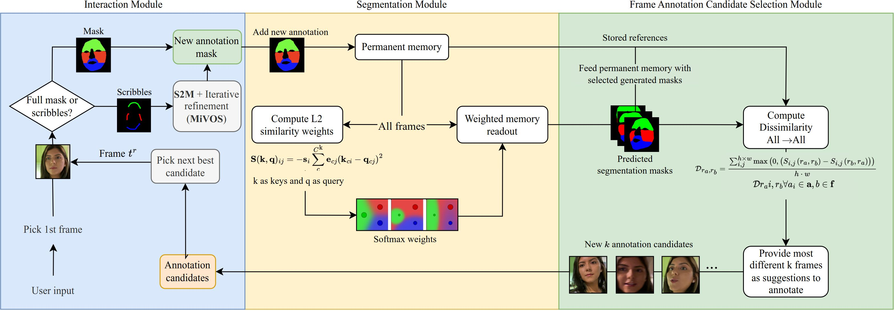

# Interactive GUI

First, set up the required packages following [Installation steps in REDME](../README.md#getting-started). Don't forget to downlaod the pretrained models from there as well.

You will need some additional packages and pretrained models for the GUI. For the packages,

The interactive GUI is modified from [XMem](https://github.com/hkchengrex/Xmem). We keep the same modules for interactions ([f-BRS](https://github.com/saic-vul/fbrs_interactive_segmentation) and [S2M](https://github.com/hkchengrex/Scribble-to-Mask)). You will need their pretrained models. Use `./scripts/download_models_demo.sh` or download them manually into `./saves` from [GitHub](https://github.com/hkchengrex/XMem/releases/tag/v1.0).

|  | 
|:--:| 
| _XMem++ updated GUI with it's References tab, which show current annotations used as refernces in the permanent memory as well as_ |
## Try it for yourself

XMem++ includes 2 short sample videos in [example_videos directory](../example_videos/), you can use them to test the demo.

The entry point is `interactive_demo.py`. To run the GUI on a new video:
```Bash
python interactive_demo.py --video example_videos/chair/chair.mp4
```

To run on a list of images:
```Bash
python interactive_demo.py --images example_videos/chair/JPEGImages
```

Both of these commands will create a folder for the current vide in workspace folder (default is `.workspace`) and save all the masks and predictions there.


To keep editing an existing project in a workspace, run the following command:
```Bash
python interactive_demo.py --workspace ./workspace/<video_name>
```

If you have more than 1 object make sure to add `--num-objects <num_objects>` to the commands above the **first time you create a project**. It will saved in the project file after that for your convenience =)

Like this:
```Bash
python interactive_demo.py --images example_videos/caps/JPEGImages --num-objects 2
```

### Run in Docker
To run the GUI in Docker, simply run the following command:
```Bash
./run_gui_in_docker.sh --video example_videos/chair/chair.mp4 --num_objects 2
```
For the GUI you can change variables `$LOCAL_WORKSPACE_DIR` and `$DISPLAY_TO_USE` in [run_gui_in_docker.sh](run_gui_in_docker.sh#L54) if necessary.

_Be wary that the interactive import buttons will not work (they will open paths within the container filesystem, not the host one)._

## Features
* Has an **object selector** with color indication to edit masks for different objects. Either click them or press '1', '2', etc. on the keyboard.
* **Reference tab** - shows which frames you already saved into the permanent memory as references and allows you to remove/edit them
* Also shows which frames were last recommended to annotate by the frame annotation candidate selection algorithm.
* Frames previously chosen as references and saved in the permanent memory will be re-loaded if the run was interrupted/closed.
* Hover-on tooltips available for most of the controls in the app:


**And from the original XMem:**
* Low CPU memory cost. Unlike the implementation in MiVOS, we do not load all the images as the program starts up. We load them on-the-fly with an LRU buffer.
* Low GPU memory cost. This is provided by XMem. See the paper.
* Faster than MiVOS-STCN, especially for long videos. ^
* You can continue from interrupted runs. We save the resultant masks on-the-fly in the workspace directory from which annotation can be resumed. The memory bank is not saved and cannot be resumed.

## Workflow
|  | 
|:--:| 
| _XMem++ recommended workflow_ |

1. Load the demo.
2. Provide at least one mask (if none exist yet) - draw it or import an existing one.
3. Run FULL propagation once.
4. [Optional] - Click "Compute annotation candidates" and get a list of the next $k$ frames suggested for annotation.
5. Annotated/Fix masks for one or more frames, save them to references.
6. Repeat steps 3-5.

## Image editing
Fun fact - you can use XMem++ for just editing the masks! If there are some minor inaccuracies with a few predicted masks, you can just edit them directly and close the app - the changed will be saved. _You don't have to run the propagation for this_, and it's easier than loading each mask into an image editor, fixing and saving separately.

## Controls

* Use the slider to change the current frame. "Play Video" automatically progresses the video.
* Select interaction type: "scribble", "click", or "free". Both scribble and "free" (free-hand drawing) modify an existing mask. Using "click" on an existing object mask (i.e., a mask from propagation or other interaction methods) will reset the mask. This is because f-BRS does not take an existing mask as input.
* Select the target object using the number keys or clicking on the corresponding color/object number on the left. "1" corresponds to the first object, etc. You need to specify the maximum number of objects when you first create a project through the command line.
* Use propagate forward/backward to let XMem do the job. **Use FULL propagate after you changed some masks in the permanent memory**. Pause when correction is needed. It will only automatically stops when it hits the end/start of the video.
* Make sure all objects are correctly labeled before propagating. The program doesn't care which object you have interacted with -- it treats everything as user-provided inputs. Not labelling an object implicitly means that it is part of the background.
* The memory bank might be "polluted" by bad memory frames. Feel free to hit clear memory to erase that.
* All output masks and overlays are automatically saved in the workspace directory, which is printed when the program starts.
* You can load an external mask for the current frame using "Import mask".
* For "layered insertion" (e.g., the breakdance demo), use the "layered" overlay mode. You can load a custom layer using "Import layer". The layer should be an RGBA png file. RGB image files are also accepted -- the alpha channel will be filled with `1`s.
* The "save overlay during propagation" checkbox does exactly that. It does not save the overlay when the user is just scrubbing the timeline.
* For "popup" and "layered", the visualizations during propagation (and the saved overlays) have higher quality then when the user is scrubbing the timeline. This is because we have access to the soft probability mask during propagation.
* Both "popup" and "layered" need a binary mask. By default, the first object mask is used. You can change the target (or make the target a union of objects) using the middle mouse key.

## FAQ

1. What are references? 
   - They are just frames with correct masks (verified by the user), which the model treats as examples for segmenting other frames.
1. How does the frame annotation candidate selection work?
   - It takes previous references and select $k$ new ones that would maximize the diversity of appearance of the target object.
1. Do I have to annotate and use all the candidate suggested to me?
   - Not at all! These are simply suggestions, you can do with them however you please.
1. Some of the frame candidates that I was given already have good masks! I don't need to edit them.
   - That's totally fine, they were selected because the target object on them looks different to those already in use, we do not try to estimate how good or bad the current segmentation is [for a good reason](../README.md#frame-annotation-candidate-selector).
1. I only see 1 object!
   - Make sure you specified `--num_objects` when you first create the project.
1. The GUI feels slow!
   - The GUI needs to read/write images and masks on-the-go. Ideally this can be implemented with multiple threads with look-ahead but it hasn't been yet. The overheads will be smaller if you place the `workspace` on a SSD. You can also use a ram disk.
   - It takes more time to process more objects. This depends on `num_objects`, but not the actual number of objects that the user has annotated. *This does not mean that running time is directly proportional to the number of objects. There is significant shared computation.*
1. Can I run this on a remote server?
   - X11 forwarding should be possible, but untested.
1. Will this work on Windows?
   - So far only tested on Linux, but should be possible to run it on other platforms as well. It's just Python and PyQt.
