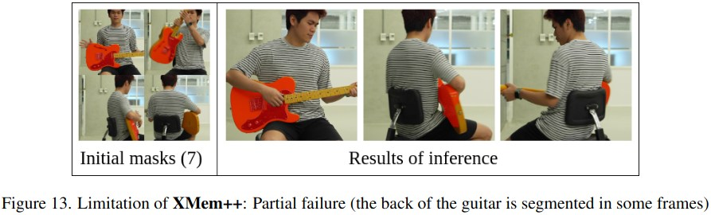

# Limitations

Since XMem++ is built on top of [XMem](https://github.com/hkchengrex/XMem), it shares common failure cases with it. 

We have also identified a new limitation of memory-based methods which is as follows:

## Negative masks are problematic

If the model is prone to predict a lot of false-positive segmentations on a particular video, it might not be easy to get rid of them by just providing empty ground truth masks:

    

**However, this is easy to deal with**:

- If there are **no objects** that must be segmented, then the user can just very quickly remove unwanted masks in the editing (just "Reset frame" -> "Next frame" -> "Repeat") or by deleting the unwanted mask files.
- If there is at least a **small part of the target object** present, then providing a ground truth mask for it will likely remove unwanted false positive segmentations.

We further re-iterate on the original limitations provided by [Ho Kei (Rex) Cheng](https://hkchengrex.com/) in their original XMem repository's [FAILURE_CASES.md document](https://github.com/hkchengrex/XMem/blob/main/docs/FAILURE_CASES.md). The following examples are taken from there:

## Original XMem limitations

> Like all methods, XMem can fail. Here, we try to show some illustrative and frankly consistent failure modes that we noticed. We slowed down all videos for visualization.
### Fast motion, similar objects

> The first one is fast motion with similarly-looking objects that do not provide sufficient appearance clues for XMem to track. Below is an example from the YouTubeVOS validation set (0e8a6b63bb):

https://user-images.githubusercontent.com/7107196/179459162-80b65a6c-439d-4239-819f-68804d9412e9.mp4

> And the source video:

https://user-images.githubusercontent.com/7107196/181700094-356284bc-e8a4-4757-ab84-1e9009fddd4b.mp4

> Technically it can be solved by using more positional and motion clues. XMem is not sufficiently proficient at those.

## Shot changes; saliency shift

> Ever wondered why I did not include the final scene of Chika Dance when the roach flies off? Because it failed there.
>
> XMem seems to be attracted to any new salient object in the scene when the (true) target object is missing. By new I mean an object that did not appear (or had a different appearance) earlier in the video -- as XMem could not have a memory representation for that object. This happens a lot if the camera shot changes.

https://user-images.githubusercontent.com/7107196/179459190-d736937a-6925-4472-b46e-dcf94e1cafc0.mp4

> Note that the first shot change is not as problematic.

_However, this problem can now be partially mitigated with using **more annotations** to correct the model's false positive predictions._

